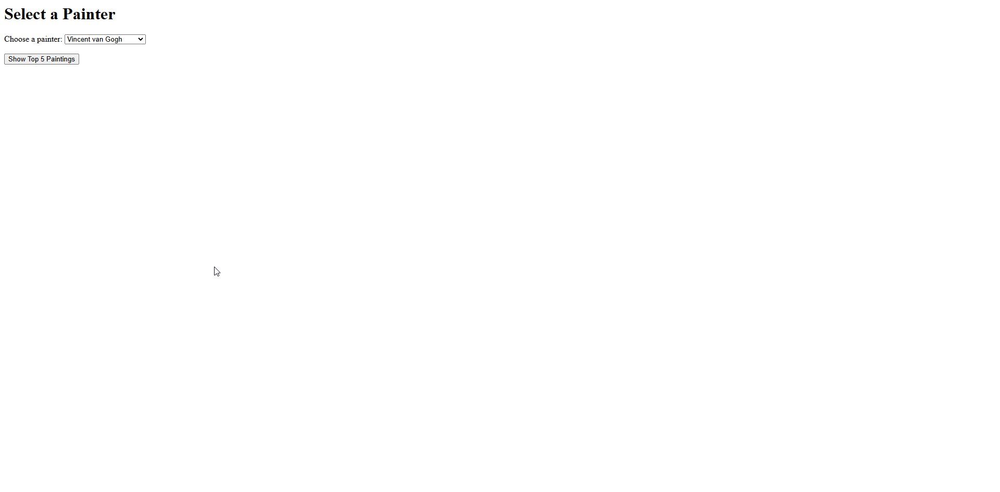

[](https://github.com/syedhumarahim/docker_app/actions/workflows/main.yml)

# Famous Paintings Web App

This application allows users to select a painter from a dropdown list and view their top 5 most famous paintings. These artists are my top 5 favorite painters. It is built with Python and Flask, and can be containerized using Docker. Continuous Integration and Continuous Deployment (CI/CD) is set up to build and push the Docker image to Docker Hub on every push to the `main` branch.


[Link to dockerhub repo](https://hub.docker.com/repository/docker/syedhumarahim/paintings_name/general)

## Features
- Interactive dropdown to select from a list of painters.
- Dynamically displays the top 5 paintings of the chosen painter.
- Containerized with Docker for easy deployment.
- Set up with a GitHub Actions CI/CD pipeline to build and push the image to Docker Hub.

## File Structure

├── .github/
│   └── workflows/
│       └── build_and_push.yml     # GitHub Actions workflow for CI/CD
├── app.py                          # Flask application code
├── Dockerfile                      # Docker configuration file
├── Makefile                        # Handy commands to build, run, and push Docker image
├── requirements.txt                # Python dependencies (Flask, etc.)
└── README.md                       # Project documentation


## Requirements
- Python 3.9 or later (for local testing without Docker)
- Flask (specified in `requirements.txt`)
- Docker (if you want to build and run the container locally)
- A Docker Hub account (if you want to push the Docker image to Docker Hub)

## Setup Instructions

### 1. Run Locally (without Docker)
1. Install dependencies:
    ```
    pip install -r requirements.txt
    ```
2. Run the application:

    ```
    python app.py
    ```

3. Open your browser and go to:

    http://localhost:5000

You will see a dropdown list of painters. Select one and click "Show Top 5 Paintings" to view their famous works.

### 2. Build and Run with Docker

Ensure Docker is installed and running.

Build the Docker image:

```
docker build -t paintings_app .
```

Run the Docker container:

``` 
docker run -p 5000:5000 paintings_app
```

Open your browser and go to:


http://localhost:5000

### 3. Using the Makefile

If you prefer, you can also use the provided Makefile:

To build the Docker image:

```
make build
```

To run the container:

```
make run
```

To push the image to Docker Hub:

```
make push
```

(Requires DOCKER_ID_USER and credentials setup)

### 4. CI/CD Setup with GitHub Actions
This project includes a GitHub Actions workflow (.github/workflows/main.yml) that:

Builds the Docker image on every push to main.
Logs in to Docker Hub using your GitHub repository secrets (DOCKER_USERNAME and DOCKER_PASSWORD).
Pushes the image to Docker Hub.

### 5. Screenshots
Below is the gif demonstrating the application in action.

1. Homepage (Dropdown selection)

2. Top 5 Paintings by Vincent van Gogh

3. Top 5 Paintings by Diego Velázquez



## Troubleshooting

If you encounter ImportError: cannot import name 'url_quote' from 'werkzeug.urls', ensure Flask and Werkzeug versions are compatible by updating requirements.txt:

```
Flask==2.0.3
Werkzeug==2.0.3
```

If Docker commands are not recognized, ensure Docker is installed and running.
